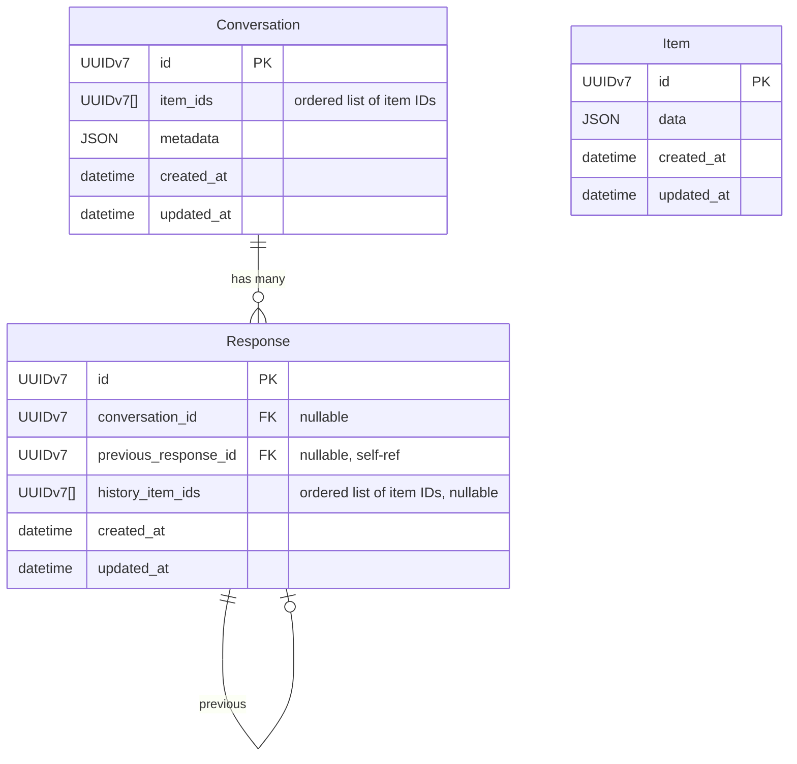

# ADR-02: Response Store semantics for `previous_response_id`

> **Status:** Accepted
> **Related discussion:** [Issue #14](https://github.com/vllm-project/agentic-apis/issues/14)

## Intention

Define the accepted response store semantics behind `previous_response_id`, so `agentic-apis` can support
multi-turn continuation without requiring clients to replay full history on every request.

The response store must serve both the Responses API and the Conversation API. The accepted design is a middle
ground between fully duplicating every prior item in each response row and walking a per-item or per-response chain
at request time.

## Context

`previous_response_id` is only useful if `agentic-apis` retains enough prior state to reconstruct the next turn.

Without a server-side continuation model:

- clients must resend the full prior conversation
- request payloads grow with every turn
- client and server state are easier to drift out of sync
- multi-turn behavior becomes less ergonomic and harder to reason about

At a high level, the continuation model is:

> next turn context = prior context + prior output + new input

That makes a stored response more than a plain output artifact. It is a continuation checkpoint, or at least a
pointer to whatever state must be loaded to rebuild one.

## Scope

This ADR settles the MVP direction for:

1. continuation shape for `previous_response_id`
2. the persisted table model
3. the backing store model
4. the data needed to rehydrate a response correctly
5. when response state should be persisted

This ADR does not attempt to settle:

- long-term memory or summarization policy
- analytics or reporting
- exact infrastructure wiring
- final retention policy details
- multi-user handling, tenant isolation, or RBAC

## Decision

Use a relational-first, three-table response store:

The accepted decisions are:

| # | Decision | Outcome |
|---|----------|---------|
| D1 | Continuation shape | Use an ordered item-ID checkpoint for hot-path rehydration |
| D2 | Storage model shape | Use `Conversation`, `Response`, and `Item` tables |
| D3 | Backend model | Use a relational-first model with JSON item payloads |
| D4 | What to store | Store item payloads once, with ordered item IDs on `Response` or `Conversation` |
| D5 | Persistence behavior | Persist state only when API semantics require retrievable continuation and storage is enabled |

## Rehydration model

For a Responses API request without a conversation, `Response.history_item_ids` is the continuation checkpoint.
The request-time read path is:

1. load the `Response`
2. bulk fetch all `Item` rows referenced by `history_item_ids`
3. restore item order in application code
4. append the new input for the next model request

For a Conversation API request, `Conversation.item_ids` is the ordered history source. When
`Response.conversation_id` is present, `Response.history_item_ids` should be omitted or null to avoid storing the
same ordered history list in both tables.

`Response.previous_response_id` is used for Responses API request for responses continuation.

## Rationale

The design is a middle ground between three alternatives:

- embedding the full history payload in every `Response`
- walking the `previous_response_id` chain to reconstruct history
- storing each item once and storing ordered item IDs on the object used for rehydration

Embedding full history in every response gives simple reads, but it duplicates payloads heavily. Across a growing
conversation, accumulated full-history rows can approach O(N^2) total stored message content because each new
response repeats prior turns. This becomes expensive quickly when reasoning tokens or tool payloads are much larger
than final text responses.

Walking a chain stores less data, but it makes the hot read path more complex and slower. A cache could hide some of
that cost, but the MVP should make the database model efficient before adding cache-dependent semantics.

The accepted model stores each item once in `Item` and stores the ordered history as UUIDv7 references. This keeps
the access pattern simple while avoiding repeated full payload copies. The expected access pattern is bounded and
whole-history oriented: history is bounded around 1000 items, reads load the full history for continuation, and new
items go onto a new `Response` rather than being appended to an existing response row.

## Data to store

A stored response needs enough state to rehydrate the next turn without relying on client replay. At minimum, the
store must preserve:

- ordered item IDs representing the model-visible history for the continuation point
- item payloads for user input, assistant output, tool calls, and tool results
- the effective tool configuration from the prior turn, when relevant to continuation
- tool-choice information, subject to compatibility rules
- instructions or equivalent system/developer input, subject to compatibility rules
- response ID, parent response ID, model, timestamps, and expiry metadata where applicable

`Item.data` should be versioned JSON. The schema version may live inside `Item.data` unless later query patterns
justify promoting it to a first-class column.

## Compaction

Compaction should create new items and a new response checkpoint instead of mutating historical response rows.

For example, compaction can create a summary item and then create a new `Response` whose ordered history references
that summary item plus any retained recent items. Existing `Response` and `Item` rows should remain intact while
retention permits. This preserves rollback and debugging options if compaction produces a poor summary, while
allowing the active continuation checkpoint to become smaller.

## Compatibility notes

OpenAI Responses API behavior is relevant where it is clear, but storage and inheritance are separate concerns.

OpenAI's Responses API docs indicate that:

- `store: false` disables storage
- the Responses API stores application state by default unless retention settings override that behavior
- when `previous_response_id` is used, prior `instructions` are not automatically carried forward

Observed OpenAI-compatible behavior from exploratory testing suggests that:

- omitted `tools` may still be recoverable across continuation when the prior turn established them
- an explicit `tool_choice` should not be assumed valid if the continuation request omits the corresponding `tools`
- prior `instructions` need to be provided on each new turn, so they should not be assumed to persist automatically
  even if they are stored

That gives three guardrails:

1. the stored payload should be rich enough to reproduce continuation semantics without relying on client replay
2. inheritance rules should be documented carefully rather than assumed from internal implementation convenience
3. a field may need to be stored even if it should not automatically inherit

This is an inference from the OpenAI docs, not a claim that `agentic-apis` must exactly mirror every OpenAI
implementation detail.

Sources:

- [OpenAI Responses API reference](https://platform.openai.com/docs/api-reference/responses/retrieve)
- [OpenAI data controls](https://platform.openai.com/docs/models/how-we-use-your-data)
- [OpenAI migrate to Responses guide](https://platform.openai.com/docs/guides/migrate-to-responses)

## Implications

- request-time rehydration does not require walking the `previous_response_id` chain
- item payloads are not duplicated in every response checkpoint
- the same tables can serve both Responses API and Conversation API flows
- lineage remains inspectable through `previous_response_id`
- the model leaves room for future lifecycle, retention, and RBAC work without making those in scope for the MVP
- ordered UUID arrays require application code to restore item order after a bulk fetch
- the store is not fully normalized because ordered history is kept as an array on `Response` or `Conversation`
- compaction and retention still need precise implementation policy outside this ADR
