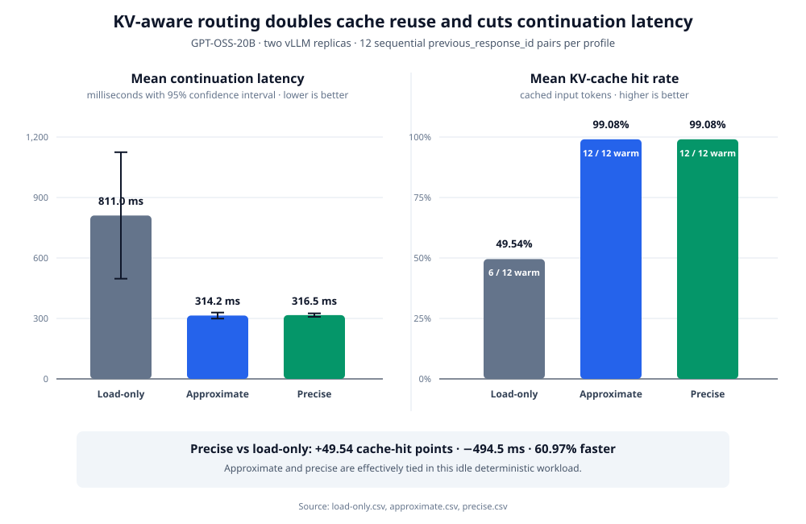

# ADR-04 - KV-affine continuation for agentic Responses workloads

> **Status:** Draft
> **Date:** 2026-07-13
> **Related:** [ADR-01 - Core Architecture](ADR-01_core.md), [ADR-02 - Response Store](ADR-02_response_store.md), [ADR-03 - Layered Crate Architecture](ADR-03_gateway_integration.md), [vLLM RFC #48501](https://github.com/vllm-project/vllm/issues/48501), [llm-d-router epic #1979](https://github.com/llm-d/llm-d-router/issues/1979)

---

## Decision

The primary objective is to maximize the fraction of model-visible prompt tokens that reuse resident KV-cache blocks for Responses and Conversation continuations. Lower time to first token (TTFT), lower render/tokenization cost, and smaller request bodies are expected secondary outcomes and must be measured separately.

The system will use the following request order for model inference:

```text
client
  -> agentic-api: authenticate, rehydrate logical state, and plan continuation
  -> llm-d: derive or validate router-visible prefix identity and choose a KV-affine vLLM pod
  -> selected vLLM pod: resolve the exact prompt tokens, reuse resident KV blocks, and generate
  -> agentic-api: execute gateway tools, commit accepted logical state, and return/continue the response
```

An llm-d deployment in front of `agentic-api` may route gateway replicas, but it cannot make the vLLM KV-affinity decision because it has not yet seen the rehydrated model-visible prompt. The llm-d endpoint picker responsible for vLLM placement must run after `agentic-api` rehydrates the request. In the current architecture, `agentic-api` should set its LLM base URL to that llm-d inference endpoint.

The design separates six kinds of identity and state:

1. **Logical checkpoint** - durable Responses or Conversation items owned by `agentic-api`.
2. **Session policy coordinates** - a tenant-scoped `session_tag` and immutable logical `continuation_id` used to describe lineage, lifecycle, and retention intent.
3. **Model execution fingerprint** - the model, tokenizer, renderer/template/parser, tools, LoRA, multimodal, salt, and key-format configuration under which tokens and KV identity are valid.
4. **Token-prefix artifact** - the exact rendered token sequence and render identity for a checkpoint.
5. **Router prefix identity** - the ordered llm-d canonical block-key chain used to score pod locality.
6. **Resident KV blocks** - evictable model state owned by a vLLM engine and reported with an engine epoch through KV events.

These objects are related, but none is a substitute for another. A response or continuation ID does not prove token identity, a token hash cannot reconstruct tokens, router block keys are not vLLM KV tensors, a session label does not identify one physical block, and an endpoint-local handle is not durable conversation state.

### Session coordinates are policy metadata, not KV identity

The upstream [vLLM session-orchestration RFC](https://github.com/vllm-project/vllm/issues/48501) and [llm-d-router session epic](https://github.com/llm-d/llm-d-router/issues/1979) correctly place fleet-level policy in llm-d and cache mechanics in vLLM. This ADR adopts their additive session-label and lifecycle direction, but it does not treat a request-level, byte-derived coordinate as interchangeable with exact KV identity.

- `session_tag` is a stable, opaque, tenant-scoped policy handle for a conversation or agent lineage. Agentic-api or a trusted control plane mints it after authentication. A client-declared identifier may be an input to that mapping, but is never trusted as a globally unique cache namespace.
- `continuation_id` identifies one immutable accepted checkpoint or branch node within that lineage. It is useful for lifecycle state and recomputable logical ancestry, but it does not by itself prove that two engines can share KV.
- `previous_response_id` is an immediate predecessor reference rather than a stable session root. Agentic-api must resolve and authorize its lineage before emitting internal session coordinates.
- Exact KV reuse remains defined by the rendered token chain and all block-hash inputs: parent identity, model execution fingerprint, LoRA and multimodal identity, prompt-embedding identity, `cache_salt`, cache group, and key-format version.

Session coordinates may ride `BlockStored` and related events as additive labels so llm-d can associate resident extents with live programs. Existing engine block hashes, token/extra-key evidence, cache-group identity, and storage medium remain on the wire for precise routing and removal correlation. Every event stream also carries an engine instance/epoch or an equivalent reset boundary so a restart cannot leave phantom residency.

The relationship is many-to-many: one continuation spans many blocks, and one shared block may benefit many sessions or branches. A "first admitting continuation" is useful provenance but is not ownership or a complete removal address. Hash-free session-coordinate events are therefore not an accepted milestone for precise placement. Retention, offload, move, and prefetch policy may use session coordinates, but execution must resolve those coordinates to current engine-local extents and degrade safely when the mapping is stale.

The implementation will proceed in four independently useful stages:

1. **Exact Responses routing:** make llm-d render the same model-visible Responses tokens as vLLM and route full logical requests using its existing precise-prefix index. This is the first cache-hit milestone.
2. **Session lifecycle and retention:** attach trusted session coordinates to exact routing and KV events, add epoch-safe residency tracking, and apply TTL-bounded eviction preference for live paused sessions. This targets cache hits under tool pauses and memory pressure.
3. **Portable token artifacts:** avoid repeated full-history rendering and large JSON bodies by resolving a content-addressed token artifact after routing. This improves latency without changing the physical KV-cache algorithm.
4. **Certified incremental continuation:** produce only renderer-certified suffix tokens, advance token artifacts after accepted turns and tool rounds, and keep full rendering as a correctness fallback.

Endpoint-local handles may be used as an additional fast path, but correctness and routing must not depend on a handle that is valid on only one pod before llm-d has selected that pod.

---

## Success criteria

### Primary cache metrics

For each request and each agent/tool subturn, report:

- prompt token count;
- locally cached tokens reported by vLLM;
- externally loaded cached tokens, when a KV connector is used;
- `cached_tokens / prompt_tokens`;
- llm-d matched prefix blocks and total routable prefix blocks;
- whether llm-d selected the pod with the largest available matching prefix;
- event-index staleness, wrong-pod selection, and endpoint-handle miss rates;
- KV eviction, offload, reload, and full/partial reseed counts;
- session-labeled resident and retained blocks by engine epoch;
- paused-session survival rate: the fraction of reusable blocks still resident when a session resumes;
- retention directives applied, expired, ignored as stale, or resolved to no resident extent;
- useful protected-block reuse versus blocks protected but never reused;
- conversation age since its prior turn; and
- active conversation working-set tokens relative to fleet KV capacity.

The principal acceptance test is a higher cache-hit ratio under realistic concurrent agentic traffic than load-only or random routing. Exact placement and session-aware retention are measured independently so the experiment can distinguish "returned to the right pod" from "the useful blocks survived the pause." A handle-path or retention-control latency improvement without a cache-hit improvement does not satisfy the primary objective.

### Secondary latency and cost metrics

Measure the following independently:

- agentic state lookup and rehydration;
- Responses render and tokenization;
- token-artifact lookup;
- request serialization and transfer;
- llm-d token production, index lookup, scoring, and queue time;
- vLLM scheduler wait, local/remote cache lookup, prefill, and decode;
- first-token latency and total turn latency; and
- checkpoint and token-artifact persistence.

This separation prevents a render/transport improvement from being reported as a KV-cache improvement.

---

## Current request lifecycle

### 1. Client to agentic-api

`agentic-api` exposes HTTP and WebSocket Responses entry points in:

- `agentic-api: crates/agentic-server/src/handler/http/responses.rs::responses`
- `agentic-api: crates/agentic-server/src/handler/websocket/responses.rs::responses_ws`

The HTTP handler proxies stateless requests but uses `ExecuteRequest` when the request stores state, refers to a previous response/conversation, or uses a gateway-managed tool.

`agentic-api: crates/agentic-server-core/src/executor/engine.rs::ExecuteRequest::run` calls `rehydrate_conversation`. The rehydration path loads previous response or conversation items, prepends them to the new input, and clears `previous_response_id` before sending a full logical request upstream:

- `agentic-api: crates/agentic-server-core/src/executor/rehydrate.rs::rehydrate_conversation`
- `agentic-api: crates/agentic-server-core/src/executor/rehydrate.rs::from_response`
- `agentic-api: crates/agentic-server-core/src/executor/rehydrate.rs::from_conversation`

This is why vLLM-placement routing must occur after agentic-api rather than before it.

### 2. Agentic-api to llm-d

`agentic-api: crates/agentic-server-core/src/executor/request.rs::ExecutionContext::responses_url` builds the configured upstream `/v1/responses` URL. The blocking and streaming paths serialize the enriched request and post it through:

- `agentic-api: crates/agentic-server-core/src/executor/upstream.rs::fetch_blocking_payload`
- `agentic-api: crates/agentic-server-core/src/executor/upstream.rs::fetch_stream_payload`
- `agentic-api: crates/agentic-server-core/src/executor/inference.rs::send_request`

For a KV-aware deployment, this upstream URL points to llm-d rather than directly to one vLLM pod.

### 3. llm-d parsing and placement

The llm-d router recognizes `/v1/responses` in:

- `llm-d-router: pkg/epp/framework/plugins/requesthandling/parsers/openai/openai.go::OpenAIParser.Claims`
- `llm-d-router: pkg/epp/framework/plugins/requesthandling/parsers/openai/openai.go::extractRequestBody`

The exact-routing slice adds Responses to the render-backed token producer:

- `llm-d-router: pkg/epp/framework/plugins/requestcontrol/dataproducer/tokenizer/backend.go::renderBackend.produce`
- `llm-d-router: pkg/epp/framework/plugins/requestcontrol/dataproducer/tokenizer/vllm_http.go::Render`
- `llm-d-router: pkg/epp/framework/plugins/requestcontrol/dataproducer/tokenizer/vllm_http.go::RenderChat`
- `llm-d-router: pkg/epp/framework/plugins/requestcontrol/dataproducer/tokenizer/vllm_http.go::RenderResponses`

`RenderResponses` posts the unchanged logical payload copy, with the configured model stamped, to vLLM `/tokenize`; it rejects unresolved state handles, multimodal input without cache-feature identity, and empty token results. `precise-prefix-cache-producer` then hashes the prompt into llm-d canonical request keys, looks those keys up in the per-pod KV index, and publishes match information:

- `llm-d-router: pkg/epp/framework/plugins/requestcontrol/dataproducer/preciseprefixcache/producer.go::Producer.Produce`
- `llm-d-router: pkg/epp/framework/plugins/requestcontrol/dataproducer/preciseprefixcache/blockkeys.go::computeBlockKeys`
- `llm-d-router: pkg/epp/framework/plugins/scheduling/scorer/prefix/plugin.go::Plugin.Score`
- `llm-d-router: pkg/epp/framework/plugins/scheduling/picker/maxscore/picker.go::MaxScorePicker.Pick`

Load, queue, and cache locality remain separate scorer inputs. KV affinity should have enough weight to retain a long active conversation on a matching pod, while admission and queue limits must still prevent one overloaded replica from dominating all traffic.

### 4. vLLM Responses frontend

The selected pod receives `/v1/responses` through:

- `vllm: vllm/entrypoints/openai/responses/api_router.py::create_responses`
- `vllm: vllm/entrypoints/openai/responses/serving.py::OpenAIServingResponses.create_responses`
- `vllm: vllm/entrypoints/openai/responses/serving.py::OpenAIServingResponses._create_responses`

Harmony requests are rendered by `_make_request_with_harmony`; other supported models are normalized through `_make_request` and `online_renderer.preprocess_chat`. Built-in tool calls loop through `_generate_with_builtin_tools`, which renders another prompt and calls the engine again after each tool result.

The exact-routing slice extends vLLM's existing `/tokenize` endpoint rather than adding a parallel Responses render route:

- `vllm: vllm/entrypoints/serve/tokenize/protocol.py::TokenizeResponsesRequest`
- `vllm: vllm/entrypoints/serve/tokenize/serving.py::ServingTokenization.create_tokenize`
- `vllm: vllm/entrypoints/openai/responses/serving.py::OpenAIServingResponses.render_response_inputs`
- `vllm: vllm/entrypoints/generate/api_router.py::init_generate_state`

`render_response_inputs` calls the same `_make_request_with_harmony` and `render_for_completion` path used before generation. `/tokenize` returns `TokenizeResponse.tokens`; it does not invoke `EngineClient.generate`, execute tools, or persist a response. This shared method path is the token-parity contract for the GPT-OSS proof.

### 5. vLLM engine and APC

The Responses frontend calls `engine_client.generate`. The engine path is:

```text
OpenAIServingResponses._generate_with_builtin_tools
  -> AsyncLLM.generate / AsyncLLM.add_request
  -> InputProcessor.process_inputs
  -> EngineCoreRequest
  -> Request.from_engine_core_request
  -> Scheduler.schedule
  -> KVCacheManager.get_computed_blocks
  -> model executor / GPU worker
  -> Scheduler.update_from_output
  -> Request.append_output_token_ids
```

Code references:

- `vllm: vllm/v1/engine/async_llm.py::AsyncLLM.generate`
- `vllm: vllm/v1/engine/input_processor.py::InputProcessor.process_inputs`
- `vllm: vllm/v1/request.py::Request`
- `vllm: vllm/v1/core/sched/scheduler.py::Scheduler.schedule`
- `vllm: vllm/v1/core/kv_cache_manager.py::KVCacheManager.get_computed_blocks`
- `vllm: vllm/v1/engine/core.py::EngineCore.step`
- `vllm: vllm/v1/core/sched/scheduler.py::Scheduler._update_request_with_output`

vLLM already appends accepted generated token IDs to the request and computes new full-block hashes. `KVCacheManager.allocate_slots` caches only finalized tokens, so completed generated full blocks become reusable APC entries without a new KV-materialization API.

The continuation protocol is therefore an input/token-transport optimization layered on top of APC. It does not create the physical KV cache.

APC only matches full hash blocks. Even if every prompt block is cached, vLLM currently recomputes at least the last token to obtain logits and can recompute a full block because slot allocation is block aligned. Acceptance language must say "reuse the maximum safe cached prefix," not "compute only the marginal suffix" as an absolute guarantee.

### 6. KV events back to llm-d

When blocks are cached, vLLM publishes `BlockStored` events containing engine block hashes, parent hash, token IDs, block size, LoRA identity, medium, extra hash keys, and cache-group metadata:

- `vllm: vllm/distributed/kv_events.py::BlockStored`
- `vllm: vllm/v1/core/block_pool.py::BlockPool._build_block_stored_event`

llm-d ingests those events, derives its canonical request keys from the event tokens, and maps the vLLM engine hashes to router-visible keys:

- `llm-d-kv-cache: pkg/kvevents/engineadapter/vllm_adapter.go::VLLMAdapter.convertBlockStoredEvent`
- `llm-d-kv-cache: pkg/kvevents/pool.go::Pool.processEventBatch`
- `llm-d-kv-cache: pkg/kvcache/kvblock/token_processor.go::chunkedTokenDatabase.TokensToKVBlockKeys`

This mapping is important: vLLM engine hashes and llm-d request keys are not one interchangeable hash chain.

For session-aware lifecycle policy, vLLM may additionally echo trusted `session_tag` and `continuation_id` values on store/reuse events. These labels are excluded from block hashing and do not change APC reuse. llm-d records them as a many-to-many association with the exact block/extent entries it already learned from the event.

Removal and reset processing remains grounded in exact engine identity. A request-level continuation label cannot replace `BlockRemoved.block_hashes` because the same request label covers many blocks and shared blocks may have been admitted or reused by multiple continuations. Event batches must include an engine instance/epoch, or consumers must receive an explicit reset boundary that invalidates every observed extent for the restarted engine. `AllBlocksCleared` invalidates residency for the current epoch without invalidating durable logical checkpoints or token artifacts.

### 7. Persistence and tool continuation

Agentic-api can make up to ten upstream gateway-tool rounds inside one client response:

- `agentic-api: crates/agentic-server-core/src/executor/engine.rs::run_until_gateway_tools_complete`
- `agentic-api: crates/agentic-server-core/src/executor/gateway.rs::append_output_items_to_input`
- `agentic-api: crates/agentic-server-core/src/executor/gateway.rs::append_tool_outputs`

Each upstream round is a new opportunity for a KV hit and a new risk of moving the conversation to a cold pod. Tool subturn affinity is part of this ADR, not a later optimization.

After the final accepted round, agentic-api persists through:

- `agentic-api: crates/agentic-server-core/src/executor/persist.rs::persist_if_needed`
- `agentic-api: crates/agentic-server-core/src/storage/response.rs::ResponseStore.persist`
- `agentic-api: crates/agentic-server-core/src/storage/conversation.rs::ConversationStore.persist`

Logical output and continuation metadata must become committed together. A prefix artifact must never be promoted as the durable continuation point if the logical response was not accepted into the response/conversation store.

---

## State and identity model

### Logical checkpoint

Every stored response checkpoint is immutable and contains or refers to:

```text
response_id
previous_response_id or conversation lineage
ordered accepted input/output items
status and incomplete reason
effective model-facing request configuration
token_prefix_artifact_id, when certified
router_prefix_receipt, when available
```

Branches from the same prior response receive independent child checkpoints. Conversation "latest" updates require compare-and-swap or another serialization mechanism so concurrent turns cannot claim the same sequence or overwrite each other's continuation metadata.

Rehydration for a certified checkpoint must fail closed if any referenced item is missing or cannot be decoded. The current response and conversation stores use `filter_map` while decoding items; the continuation path must not silently shorten history:

- `agentic-api: crates/agentic-server-core/src/storage/response.rs::ResponseStore.rehydrate`
- `agentic-api: crates/agentic-server-core/src/storage/conversation.rs::ConversationStore.rehydrate`
- `agentic-api: crates/agentic-server-core/src/storage/models/item.rs::Item.as_inout`

### Session policy coordinates

Agentic-api persists or deterministically resolves two internal coordinates with each accepted checkpoint:

```text
session_tag
continuation_id
tenant_scope
lineage_parent
status: active | paused | completed | expired
```

`session_tag` stays stable across turns in one authorized lineage. `continuation_id` changes at each accepted checkpoint and forks when multiple children extend the same parent. Neither field is forwarded from an untrusted public request without namespace validation. They are also not inputs to vLLM block hashing: cache isolation remains enforced by `cache_salt` and the full execution fingerprint.

llm-d uses these coordinates for lifecycle policy only after exact placement inputs are available. A session-affinity estimate may seed a preference before event confirmation, but it cannot claim that KV is resident. Event-backed block keys determine exact locality; labeled events associate that locality with sessions; engine epochs determine whether the observation is current.

### Token-prefix artifact

A token-prefix artifact is immutable, content addressed, and sufficient to reconstruct the exact engine input without re-rendering logical history.

```text
artifact_id
token_ids or an authenticated reference to the token bytes
token_count
token_hash
safe_append_boundary
model_execution_fingerprint
created_at
expiration and retention class
```

Hashes and counts validate an artifact; they do not replace its token contents. If token IDs are not retained anywhere, a handle miss necessarily falls back to full logical re-render and loses the smaller-request/reconstruction benefit.

Token IDs are sensitive prompt data. Storage, encryption, retention, audit, deletion, and tenant isolation must be equivalent to the policy for the underlying conversation text.

The artifact ID must be portable across vLLM frontend replicas. A selected pod may keep a local artifact cache, but it must be able to resolve a cache miss from an authenticated shared artifact service or receive inline token bytes on a reseed request.

### Model execution fingerprint

The fingerprint covers every input that can change token identity or APC block identity:

```text
served model name and immutable weights revision
tokenizer implementation and revision
remote-code revision, when used
renderer and renderer version
chat template content and template arguments
reasoning mode, effort/budget, and thinking flags
reasoning parser and tool parser identity
effective instructions and tools
LoRA adapter name and immutable revision
multimodal feature identities and prompt-embedding identity
cache_salt policy and salt identity
vLLM block-hash format/version
llm-d canonical request-key format/version
hash block size and scheduler/cache group metadata
```

A model alias by itself is insufficient during rolling deployments. Requests must not reuse a token artifact or router receipt across incompatible model weights, adapters, tokenizers, templates, or cache salts.

### Router prefix receipt

The router prefix receipt is an internal, authenticated description of the ordered llm-d canonical keys for the reusable prefix:

```text
format and version
model routing identity
cache_salt identity
canonical block size
ordered canonical block keys
covered token count
token artifact hash
expiration
issuer and authentication tag
```

It is not a list of unlabeled vLLM engine hashes. llm-d computes canonical keys using `Indexer.ComputeBlockKeysFromTokens` and its `TokenProcessor`; event ingestion separately maps vLLM engine keys to those canonical request keys:

- `llm-d-kv-cache: pkg/kvcache/indexer.go::Indexer.ComputeBlockKeysFromTokens`
- `llm-d-kv-cache: pkg/kvcache/kvblock/token_processor.go::chunkedTokenDatabase.hash`
- `llm-d-kv-cache: pkg/kvevents/pool.go::Pool.processEventBatch`

The receipt may be minted during an initial full-render routing pass and persisted with the logical checkpoint. Active-active EPP replicas must share the receipt verification key and key-format configuration.

### Resident KV blocks

Resident KV blocks remain owned and evicted by vLLM. They are addressed by vLLM's block hash, model/adaptor/multimodal/salt extra keys, cache group, storage medium, and engine epoch. llm-d's event index is a possibly stale observation of that state, not a lease or guarantee.

`prompt_cache_ref` must therefore not imply that KV tensors are pinned. If the term is retained, it refers to a token-prefix artifact or an optional endpoint-local shortcut, while cache-hit status remains an execution-time result.

---

## Continuation protocols

### Stage 1: exact Responses routing with ordinary full requests

This stage maximizes KV hits before introducing a token handle.

1. Agentic-api rehydrates the complete logical Responses input.
2. llm-d's token producer calls vLLM `/tokenize` with the fully rehydrated Responses request.
3. llm-d computes canonical block keys and scores each pod against its KV-event index.
4. llm-d forwards the unchanged logical request to the selected vLLM pod.
5. vLLM renders the same token sequence, APC reuses the matching full blocks, and generation emits new KV events.

The tokenizer and inference path must share model, tokenizer, template, parser, and renderer configuration. The GPT-OSS parity test compares `/tokenize` prompt IDs with the IDs produced by `_make_request_with_harmony`; the DGX rollout uses the same patched vLLM build for both operations.

This stage may render twice, but it proves the cache-routing path and raises hit rate independently of the more complex continuation protocol.

### Stage 2: session lifecycle and retention

After exact placement is correct, the control plane can improve survival of useful KV through agent/tool pauses:

1. Agentic-api attaches authenticated, tenant-scoped `session_tag` and `continuation_id` values after rehydration.
2. llm-d performs the same exact block-key placement as Stage 1 and records the session-to-extent association from labeled vLLM events.
3. vLLM identifies each event stream with an engine epoch; llm-d discards the prior epoch's residency on restart or reset.
4. llm-d applies a soft, TTL-bounded retention policy to exact resident extents for active or paused sessions.
5. vLLM biases eviction without pinning blocks and reports the resulting stores, removals, and resets.

The first retention interface may still be request-attached token ranges, as proposed by [vLLM RFC #37003](https://github.com/vllm-project/vllm/issues/37003). A later asynchronous `retain(session_tag, continuation_id, ttl)`-style directive requires a verified engine-local session-to-extent map; the opaque session coordinate alone is not a physical cache address.

Session affinity remains a soft placement signal. It must not override a longer exact prefix match on another healthy pod, and it must yield to admission/load safeguards when the preferred pod would materially increase queueing. A stale or unresolved retention coordinate is a performance miss and never a correctness failure.

### Stage 3: portable token artifact

After exact routing is proven:

1. The authoritative render/certification service stores the full prompt token artifact.
2. Agentic-api sends a private continuation envelope containing the artifact reference, current logical input, and cache salt.
3. llm-d validates or resolves the router receipt and chooses the best pod.
4. The selected vLLM frontend resolves the token artifact and sends the complete token sequence to `InputProcessor` without full logical re-render.
5. vLLM APC performs the same block lookup as it would for a normal rendered request.

The artifact reference is portable, so llm-d may choose any pod. A pod-local token-artifact cache is an optimization; it is not the source of truth.

### Stage 4: certified marginal suffix

The optimized private request shape is conceptually:

```json
{
  "model": "model-alias",
  "input": "current-turn logical items only",
  "stream": true,
  "cache_salt": "tenant-scoped-unpredictable-value",
  "continuation": {
    "prefix_artifact_id": "prefix_...",
    "prefix_token_hash": "sha256:...",
    "prefix_token_count": 64551,
    "model_execution_fingerprint": "exec_...",
    "router_prefix_receipt": "signed-opaque-receipt",
    "append_token_ids": [200006, 882, 200008],
    "append_boundary_certificate": "signed-renderer-certificate"
  }
}
```

These fields are private server-to-server inputs. Public OpenAI-compatible clients continue to send ordinary Responses semantics.

`append_token_ids` must be produced by the same renderer implementation that owns full rendering. Agentic-api must not assume that tokenizing strings `A` and `B` separately proves `tokenize(A + B) == tokenize(A) + tokenize(B)`.

The renderer certificate binds:

- prefix artifact hash and token count;
- append token hash and count;
- the resulting combined token hash and count;
- the model execution fingerprint;
- the safe semantic boundary; and
- expiration and tenant scope.

If the certificate cannot be produced, the request uses the Stage 3 full token artifact or the Stage 1 full logical render. Stage 2 session policy may remain active on either fallback.

### Prefix advancement

vLLM already caches full generated blocks. The protocol may advance the token artifact after generation to reduce the next request's append payload, but it is not required to create those KV blocks.

Two valid forms are supported:

1. **Prompt checkpoint plus append:** retain a handle for the previous prompt and append the accepted generated output, renderer terminal tokens, tool result, and new input on the next request.
2. **Advanced checkpoint:** after accepted generation, create a new artifact covering the prior prompt plus the accepted generated/terminal tokens, so the next append contains only tool/new-user material.

The advanced form is preferred for long outputs, but the prompt-plus-append form is a valid fallback and simplifies initial implementation.

Tool loops advance an ephemeral checkpoint after every generation/tool-result pair. Only the outer accepted response promotes an ephemeral checkpoint to durable conversation state.

---

## Miss, retry, and failure semantics

The private continuation path returns typed internal outcomes:

```text
artifact_hit
artifact_miss
artifact_expired
fingerprint_mismatch
router_receipt_invalid_or_expired
endpoint_local_shortcut_miss
safe_boundary_rejected
logical_checkpoint_conflict
```

On any continuation miss, agentic-api retries using the portable full token artifact. If that artifact cannot be resolved, it retries using full logical history and reseeds the artifact after successful rendering. Retries use the same idempotency identity so a failed optimized attempt cannot create a duplicate logical response or duplicate tool side effect.

Wrong-pod routing is a performance miss, not a correctness failure. The selected vLLM pod resolves the portable token artifact and performs the missing prefill. It must not reject a correct request merely because resident KV blocks were evicted.

Endpoint-local token shortcuts may fail after pod restart or process rotation. llm-d must either select a matching endpoint-specific shortcut after placement or omit it. Agentic-api must not attach a single endpoint-local handle and then allow llm-d to route the request to an unrelated endpoint.

Cancelled, errored, or client-aborted generations do not advance durable continuation state. Incomplete responses are eligible only when the API contract accepts them as continuable logical state and the retained token artifact corresponds exactly to that accepted output.

For streaming, logical checkpoint and prefix metadata are committed before the server reports durable completion. The current executor emits the final payload and `[DONE]` before running persistence; the implementation must move persistence into the producing task or otherwise ensure it completes independently of whether the client polls the stream again:

- `agentic-api: crates/agentic-server-core/src/executor/engine.rs::run_stream`
- `agentic-api: crates/agentic-server-core/src/executor/persist.rs::persist_response`

---

## Tenant and security requirements

`cache_salt` is part of both correctness and isolation. vLLM includes it in the first block's extra hash keys, and llm-d folds it into the first canonical request key:

- `vllm: vllm/v1/core/kv_cache_utils.py::generate_block_hash_extra_keys`
- `llm-d-router: pkg/epp/framework/plugins/requestcontrol/dataproducer/preciseprefixcache/blockkeys.go::foldCacheSalt`

Agentic-api must accept, derive, and forward an internal tenant-scoped salt. The Stage 1 benchmark required a separate implementation change that preserves an optional client/internal `cache_salt` through request parsing, rehydration, and upstream serialization:

- `agentic-api: crates/agentic-server-core/src/types/request_response.rs::RequestPayload`
- `agentic-api: crates/agentic-server-core/src/types/request_response.rs::UpstreamRequest`
- `agentic-api: crates/agentic-server-core/src/types/request_response.rs::RequestPayload::to_upstream_request`

Production tenant-to-salt derivation remains deployment policy rather than a public-client choice. The gateway must not silently discard the salt: doing so both weakens isolation and makes llm-d compute request block keys that cannot match vLLM's salted KV events.

The default production policy is one unpredictable salt per tenant and model execution domain. A per-request salt would prevent useful continuation hits; a global salt would allow cross-tenant cache probing.

Token artifacts, router receipts, append tokens, and endpoint-local shortcuts are never trusted from public clients. Private envelopes are authenticated and authorized for tenant, model, conversation/checkpoint, and expiration. Handle knowledge alone must not grant access to another tenant's token artifact.

---

## Capacity behavior

Prefix routing improves the probability of reuse; it cannot guarantee residency when the fleet's active working set exceeds KV capacity.

```text
warm matching pod:
  validate identity -> resolve tokens -> reuse longest full-block prefix -> prefill remainder -> decode

cold or evicted pod:
  validate identity -> resolve tokens -> prefill missing prefix -> decode -> publish new KV events

artifact miss:
  full logical render -> route/retry or prefill -> store artifact -> publish KV events
```

Long conversations consume many blocks and may evict multiple shorter sessions. The scheduler and router should use cache affinity together with load, queue depth, and admission control. Tests must include working sets below, near, and above aggregate HBM/CPU/offload capacity.

Retention is an eviction preference, not reserved capacity. Its value is measured by whether a protected block is reused after a pause; unused protected blocks consume an explicit policy budget and must expire. Shared prefixes should be protected once at the physical block level even when they benefit multiple labeled sessions. When total protected demand exceeds capacity, vLLM must continue to evict according to bounded priority and recency rather than promise session residency.

Tiered KV storage changes the meaning of a "hit." Metrics must distinguish HBM hits, CPU/offload hits, shared-storage loads, and full recomputation.

---

## Renderer certification

No renderer family is enabled by name alone. A certification profile fixes the model execution fingerprint and proves:

1. Full Responses rendering is deterministic for identical logical input and fingerprint.
2. The llm-d render service and vLLM inference frontend produce identical prompt token IDs.
3. Certified suffix composition produces the same tokens as a fresh full render.
4. Previous reasoning, system instructions, tool calls, and terminal tokens follow the model's real continuation semantics.
5. Parser state required to convert generated tokens into Responses output items is available on the optimized path.

Initial targets:

| Renderer family | Certification boundary |
|---|---|
| Harmony / GPT-OSS | Harmony message and terminal-token boundaries; reasoning effort, tools, and built-in tool descriptions are fingerprinted. |
| Qwen / Qwen3 | Chat-template message boundaries; thinking/reasoning flags and tool template arguments are fingerprinted. |
| GLM and parser-engine models | Parser-certified role, tool, and reasoning tag boundaries. |
| DeepSeek-style thinking models | Explicit handling of historical reasoning drops and thinking-mode configuration. |

vLLM currently demonstrates why this proof is necessary. Non-Harmony Responses replay filters prior system messages and skips prior reasoning output in `construct_input_messages`; Harmony continuation currently ignores changed reasoning and instruction parameters:

- `vllm: vllm/entrypoints/openai/responses/utils.py::construct_input_messages`
- `vllm: vllm/entrypoints/openai/responses/serving.py::OpenAIServingResponses._construct_input_messages_with_harmony`

Provider-managed encrypted or signed reasoning state is a separate remote-provider continuation concern. This ADR stores only the model-visible tokens and local renderer/parser state needed for vLLM execution. It does not define a general Claude/OpenAI remote reasoning-state abstraction.

---

## Benchmark evidence

The repository retains only the latest accepted benchmark artifacts. Earlier single-pod prompt-handle and approximate-only routing experiments informed the design, but they were superseded by the end-to-end experiment below because it exercises `previous_response_id` rehydration and compares all three routing profiles under one protocol.

### 2026-07-13 exact Responses routing experiment

The Responses-aware `/tokenize` and precise-prefix changes were then measured end to end through `previous_response_id` rehydration:

```text
benchmark client
  -> agentic-api on port 3003
  -> llm-d Envoy/EPP on port 8081
  -> GPT-OSS-20B vLLM replicas on ports 8000 and 8001
```

Both vLLM replicas used APC, 64-token blocks, and distinct KV-event publishers on ports 5557 and 5558. The precise EPP used the patched Responses token producer, two rank-indexed event subscribers, and `speculativeIndexing: false`. `/tokenize` returned the same 78-token smoke prompt on both replicas, and the KV index advanced from zero to six admissions with two successful lookup requests before measurement.

The benchmark used 12 sequential two-turn pairs per routing profile. Every pair used a new unpredictable `cache_salt`; the second turn referred only to `previous_response_id`, so agentic-api had to rehydrate the complete first turn before llm-d tokenized and routed it. Each rehydrated continuation contained 6,653 input tokens. The profile switch restarted only EPP, while both vLLM processes and their cache configuration stayed fixed.

Before the routing comparison, a fixed-replica isolation gate sent the same 12,944-token prompt with salt A, salt B, and salt B again. A and the different B both reported zero cached tokens and took 2,617.0 ms and 2,575.5 ms. Repeated B reported 12,928 cached tokens and took 283.0 ms. This proves that agentic-api forwarded `cache_salt` and that vLLM isolated different salts before the multi-replica measurements were accepted.

The three routing profiles differ only in how llm-d chooses a vLLM replica for the continuation:

- **Load-only** scores backend load, queue depth, and KV utilization without considering which replica owns the request's cached prefix. With two otherwise equivalent replicas, returning to the warm replica is therefore approximately a coin flip.
- **Approximate prefix** derives an estimated prefix identity from the logical request. It can prefer the warm replica without asking vLLM for the exact model-visible Responses tokens, but its pseudo-token identity may diverge when rendering depends on templates, tools, instructions, reasoning configuration, or branching history.
- **Precise Responses prefix** runs after agentic-api rehydration and asks vLLM `/tokenize` to render the complete request with the same Responses renderer used for inference. llm-d converts those exact token IDs into canonical block keys, consults its KV-event index, and selects the replica with the longest known matching prefix.

| Routing profile | Warm-prefix pairs | Mean continuation KV hit | Cold mean ms | Continuation mean ms | Continuation 95% CI | Mean saved vs load-only | Saved |
|---|---:|---:|---:|---:|---:|---:|---:|
| Load-only | 6 / 12 | 49.542% | 1,283.4 | 811.0 | +/- 313.8 ms | - | - |
| Approximate prefix | 12 / 12 | 99.083% | 1,281.0 | 314.2 | +/- 15.2 ms | 496.7 ms | 61.3% |
| Precise Responses prefix | 12 / 12 | 99.083% | 1,295.3 | 316.5 | +/- 8.6 ms | 494.5 ms | 61.0% |



Both cache-aware profiles increased the mean continuation hit rate by 49.542 percentage points and returned every continuation to its warm replica. Their 99.083% hit rate means vLLM reused 6,592 of 6,653 input tokens; APC matches complete blocks and still recomputes the unmatched or required tail. Cold latency stayed within 1.1% across the three profiles.

The load-only latency confidence interval is wide because its results are bimodal: its six warm-replica returns took approximately 0.30-0.42 seconds, while its six wrong-replica continuations had zero cached tokens and took approximately 1.27-1.31 seconds. Approximate and precise routing returned all 12 continuations to the warm replica, so their latency intervals are narrow and centered near 0.31 seconds.

Precise and approximate routing are effectively tied in this idle, deterministic two-turn workload. The result does not show that precise routing is faster than approximate routing. It shows that exact Responses routing reaches the same maximum observed KV reuse without relying on estimate-mode pseudo-tokens. The expected advantage of exact identity must be tested with template-sensitive inputs, tool changes, longer branching histories, concurrent load, event lag, and partial-prefix/eviction cases where approximate identity can diverge from the actual engine prompt.

Raw rows and summaries:

- [load-only rows](results/adr-04/2026-07-13-n12/load-only.csv) and [summary](results/adr-04/2026-07-13-n12/load-only.summary.json)
- [approximate rows](results/adr-04/2026-07-13-n12/approximate.csv) and [summary](results/adr-04/2026-07-13-n12/approximate.summary.json)
- [precise rows](results/adr-04/2026-07-13-n12/precise.csv) and [summary](results/adr-04/2026-07-13-n12/precise.summary.json)

This completes the single-client Stage 1 routing proof. It does not satisfy the broader production acceptance criterion until the same result holds under concurrent agent/tool traffic and cache pressure.

The benchmark matrix for this decision is:

| Dimension | Required cases |
|---|---|
| Routing | random/load-only, approximate prefix, precise Responses prefix |
| Session policy | none, soft affinity only, TTL retention only, exact routing plus affinity and retention |
| Prefix state | warm matching pod, warm wrong pod, event-index lag, evicted, pod restart |
| Pause | no pause, 5 seconds, 30 seconds, and a duration beyond the retention TTL |
| Lineage | linear turns, concurrent forks, shared prefixes across sessions, completed/expired session |
| Transport | full logical request, full token artifact, artifact plus certified suffix |
| APC | disabled, cold, warm, partially warm |
| Workload | user turns, agentic gateway tool loops, vLLM built-in tool loops |
| Capacity | below, near, and above fleet KV capacity |
| Concurrency | idle single request and production-like concurrent load |
| Event lifecycle | current epoch, delayed events, dropped events, explicit clear, engine epoch change |
| Renderer | Harmony plus every separately certified non-Harmony profile |

Every result reports cache-hit ratio and matched blocks before reporting TTFT.

---

## Required changes by project

### agentic-api

| Area | Required change | Code locations |
|---|---|---|
| Deployment topology | Point the execution LLM base URL at llm-d for routed deployments; document that ingress llm-d and inference llm-d are distinct roles if both exist. | `crates/agentic-server-core/src/executor/request.rs::ExecutionContext::responses_url`, server configuration and deployment docs |
| Request contract | Preserve `cache_salt` through parsing, rehydration, and upstream serialization (validated in Stage 1 and implemented in a separate change); add private continuation fields, idempotency identity, and typed fallback behavior without exposing token controls to public clients. | `crates/agentic-server-core/src/types/request_response.rs::{RequestPayload,UpstreamRequest,RequestPayload::to_upstream_request}`, `executor/upstream.rs` |
| Session policy identity | Resolve a tenant-scoped `session_tag`, mint immutable checkpoint-level `continuation_id` values, and forward them only as authenticated internal metadata after lineage authorization. Never use raw `previous_response_id` as the stable session root. | response/conversation storage metadata, `executor/rehydrate.rs`, `executor/upstream.rs` |
| Durable checkpoint | Persist immutable token artifact identity, execution fingerprint, router receipt, status, and lineage with the accepted response. | `storage/types/response.rs::ResponseMetadata`, response/conversation models and migrations |
| Atomic commit | Commit logical output and prefix metadata together; do not emit durable stream completion before persistence is guaranteed. | `executor/engine.rs::{run_blocking,run_stream}`, `executor/persist.rs` |
| Exact rehydration | Treat missing, corrupt, unknown, or out-of-order history items as certification failure instead of silently dropping them. | `storage/response.rs::rehydrate`, `storage/conversation.rs::rehydrate`, `storage/models/item.rs::as_inout` |
| Conversation concurrency | Add unique ordering and compare-and-swap/serialization for concurrent conversation turns. | migrations, `storage/conversation.rs::persist` |
| Tool-loop affinity | Carry ephemeral token artifact/router receipt state through every gateway-tool subturn; promote only the accepted outer result. | `executor/engine.rs::run_until_gateway_tools_complete`, `executor/gateway.rs` |
| Observability | Record fallback reason, artifact lookup, routing receipt age, matched blocks, vLLM cached tokens, conversation age, and commit latency. | executor tracing/metrics and response accumulator |

Agentic-api must not independently implement model tokenization or llm-d's canonical hash algorithm. It consumes renderer certificates and router receipts from the components that own those formats.

### vLLM

| Area | Required change | Code locations |
|---|---|---|
| Responses tokenization | Accept `ResponsesRequest` input at `/tokenize`, delegate to `OpenAIServingResponses.render_response_inputs`, and return the exact prompt IDs without generation or persistence (implemented and exercised by Stage 1). | `entrypoints/serve/tokenize/{protocol.py,serving.py}`, `entrypoints/openai/responses/serving.py`, `entrypoints/generate/api_router.py` |
| Typed session coordinates | Add optional opaque `session_tag`/`session_id` and `continuation_id` request metadata without overloading `request_id` or including the fields in block hashes; preserve them through parallel children and engine-core serialization. | OpenAI protocol/serving models, `v1/engine`, `v1/request.py` |
| Labeled, epoch-safe events | Echo trusted session coordinates on store/reuse events while retaining hashes, token/extra-key evidence, group, and medium; add engine instance/epoch or explicit reset semantics. Treat first-admitter attribution as provenance rather than ownership. | `distributed/kv_events.py::{EventBatch,BlockStored,BlockRemoved,AllBlocksCleared}`, `v1/core/block_pool.py` |
| Bounded retention mechanism | Apply request-range or resolved extent priority as a TTL-bounded eviction bias with no hard pinning and no change to unlabeled behavior. Session-addressed directives require an engine-local coordinate-to-extent map. | `v1/core/block_pool.py`, KV-cache block metadata/evictor, request protocol validation |
| Pre-tokenized Responses execution | Accept a private portable artifact reference or certified prompt tokens and feed them to `tokens_input`/`InputProcessor` without reconstructing full logical history. | `entrypoints/openai/responses/protocol.py`, `entrypoints/openai/responses/serving.py::{_make_request,_make_request_with_harmony}` |
| Artifact store | Replace an unbounded Python dictionary with a bounded, tenant-scoped, expiring local cache backed by an authenticated portable artifact service or inline reseed path. | Responses serving initialization and a focused artifact-store module |
| Validation | Bind artifacts and suffix certificates to cache salt, model weights, tokenizer, renderer/template/parser configuration, tools, instructions, LoRA, multimodal identity, and expiration. | Responses request validation and artifact resolver |
| Output token capture | Accumulate all streaming delta token IDs rather than retaining only the final delta; preserve per-tool-round token boundaries. | `entrypoints/openai/responses/context.py::HarmonyContext._update_decode_token_usage` and other context implementations |
| Prefix advancement | Optionally create an advanced prompt-plus-output artifact after accepted generation, while retaining prompt-plus-append as a valid fallback. | Responses full/stream generators and context types |
| Typed misses | Return machine-readable private miss causes that agentic-api can safely retry and reseed. | Responses error protocol and serving validation |
| APC observability | Surface local/external cached tokens, recomputed tail, artifact hit/miss, and cache group/medium without changing APC ownership. | Responses usage, scheduler stats, KV event metrics |

The implementation must reuse vLLM's existing APC path. It must not introduce a second KV-cache namespace keyed only by an application handle.

### llm-d-router

| Area | Required change | Code locations |
|---|---|---|
| Responses token production | Dispatch Responses from `renderBackend.produce` to `vllmHTTPRenderer.RenderResponses`, call `/tokenize`, preserve `cache_salt`, and fail closed for unresolved handles or unsupported multimodal identity (implemented and exercised by Stage 1). | `dataproducer/tokenizer/backend.go`, `dataproducer/tokenizer/vllm_http.go`, token-producer tests |
| Same-host event discovery | Propagate file-discovery `rankIndex` into `EndpointMetadata` so two replicas on one host subscribe at `socketPort + rankIndex` (implemented and exercised with ports 5557 and 5558). | `datalayer/discovery/file/plugin.go`, file-discovery tests, `preciseprefixcache/extractor.go::ensureSubscriber` |
| Full-prompt routing | Feed exact Responses `TokenizedPrompt` data into the existing precise-prefix producer before enabling artifact shortcuts. | token producer DAG and `preciseprefixcache/producer.go::Produce` |
| Session lifecycle policy | Consume authenticated session coordinates separately from exact `PrefixCacheMatchInfo`; maintain a many-to-many session/continuation-to-extent view, apply soft affinity/retention policy, and invalidate it by engine epoch. | focused session data types/producers, precise-prefix index integration, scheduling and lifecycle-policy plugins |
| Router receipt | Define a versioned authenticated representation of llm-d canonical block keys and a producer that validates/consumes it without accepting public client input. | new focused request-control data type/plugin plus `preciseprefixcache` integration |
| Artifact resolution | On receipt miss, resolve token artifacts or fall back to Responses rendering and recompute canonical keys. | token producer/backend and private artifact client |
| Selection/handle coordination | Apply any endpoint-local shortcut only after endpoint selection; never forward a handle for a different pod. | scheduling result/pre-request hook and private request mutation |
| Salt and identity | Preserve `cache_salt`, model, LoRA, multimodal extra keys, canonical block size, and key-format version in both computed keys and receipts. | `preciseprefixcache/blockkeys.go`, request types, receipt validation |
| Tool-loop metrics | Report matched blocks, selected endpoint, queue/load tradeoff, receipt age, and wrong-pod outcomes for every subturn. | precise producer/scorer metrics and request lifecycle hooks |

### llm-d-kv-cache

| Area | Required change | Code locations |
|---|---|---|
| Key-format contract | Export/version the canonical request-key format used by `TokenProcessor`; document hash seed, model identity, extra-key encoding, and canonical block size. | `pkg/kvcache/kvblock/token_processor.go` and architecture docs |
| Receipt support | Provide encode/validate helpers or an owned service API for canonical router receipts so agentic-api does not reimplement hashing in Rust. | focused receipt package/API using `Indexer.ComputeBlockKeysFromTokens` |
| Engine/request mapping | Preserve the mapping from vLLM engine hashes to canonical request keys across LoRA, cache salt, multimodal extras, cache groups, and storage media. | `pkg/kvevents/pool.go::processEventBatch`, adapter tests |
| Session association | Store labeled session/continuation associations as metadata on exact canonical block/extent entries; support shared blocks and remove associations without treating first admission as ownership. | event adapter/pool data model and index lifecycle tests |
| Active-active behavior | Define how receipt verification and artifact-to-key lookups work across EPP replicas and how engine epochs and `AllBlocksCleared` invalidate observed residency without invalidating durable session coordinates or token artifacts. | pool/index lifecycle and deployment docs |
| Scoring metrics | Expose longest consecutive cached blocks by medium and group, not only one aggregate score. | `pkg/kvcache/kvblock_scorer.go::LongestPrefixScorer` and metrics |

---

## Delivery sequence

### Milestone 1 - prove KV-affine Responses routing

- Enable Responses input on vLLM `/tokenize` through the inference renderer.
- Route llm-d Responses token production through `/tokenize`.
- Configure agentic-api to call llm-d after rehydration.
- Verify `/tokenize` and inference prompt-token equality.
- Run cache-hit benchmarks for user turns and gateway-tool rounds.

Exit criterion: precise routing materially increases matched/cached prompt tokens under concurrency without changing model-visible prompt IDs or Responses output semantics.

The 2026-07-13 single-client proof met the token-parity and cache-hit parts of this criterion: precise routing produced 12/12 warm returns and 99.083% mean continuation KV hits. The concurrency, cache-pressure, and agent/tool-loop portions remain open.

### Milestone 2 - make checkpoints reliable

- Add cache salt and complete execution fingerprints.
- Make rehydration fail closed for certified checkpoints.
- Make streaming persistence independent of client polling.
- Atomically store logical output and continuation metadata.
- Add conversation concurrency and idempotency controls.

Exit criterion: cancellation, retry, concurrent turn, and corrupt-history tests cannot promote an incorrect checkpoint or duplicate tool side effects.

### Milestone 3 - add session lifecycle and bounded retention

- Mint tenant-scoped `session_tag` and checkpoint-level `continuation_id` values after agentic-api lineage resolution.
- Plumb the opaque coordinates through vLLM requests without adding them to block hashes.
- Add labels and engine epoch/reset semantics to KV events while retaining exact block identity.
- Build llm-d's many-to-many session/continuation-to-resident-extent view from event truth.
- Apply soft affinity and TTL-bounded eviction priority to active or paused sessions.
- Compare exact routing alone with exact routing plus retention under tool pauses and cache pressure.

Exit criterion: retention materially increases resumed-session cached tokens and reduces TTFT under pressure without pinning blocks, creating stale residency after restart, or reducing healthy-fleet throughput beyond an explicit policy budget.

### Milestone 4 - portable token artifacts

- Add the shared/bounded artifact store and vLLM private token-artifact execution path.
- Add typed artifact miss/reseed behavior.
- Add llm-d canonical router receipts or artifact resolution.
- Compare full logical requests with full token artifacts while holding routing constant.

Exit criterion: cache-hit ratio remains equal to Milestone 1 while render/tokenization and request-transfer costs fall for long contexts.

### Milestone 5 - certified incremental suffixes

- Certify Harmony boundaries first.
- Add prompt-plus-append and advanced-checkpoint forms.
- Carry ephemeral artifacts through every agent/tool subturn.
- Certify Qwen/Qwen3, GLM, and DeepSeek-style profiles independently.

Exit criterion: suffix execution produces token IDs identical to full rendering in CI, canary samples, and fallback comparisons, while retaining or improving cache-hit ratio.

### Milestone 6 - capacity and failure testing

- Test event lag, wrong-pod routing, eviction, pod restart, engine epoch changes, `AllBlocksCleared`, and active-active EPP.
- Test working sets above HBM and aggregate tiered-cache capacity.
- Test session forks, shared prefixes, stale retention directives, and protected demand above available capacity.
- Tune cache-affinity and retention policy versus queue/load scorer weights from measured cache hits, TTFT, and throughput.

Exit criterion: the system degrades to partial/full prefill without correctness failure, and telemetry explains every cache miss.

---

## Rejected alternatives

### Put llm-d before agentic-api and route on marginal client input

Rejected for vLLM placement because the router cannot see the history that agentic-api later rehydrates. A separate ingress router may still be used for agentic-api replica balancing.

### Treat `previous_response_id` as a cache key

Rejected because response identity does not encode the rendered prompt, model/template configuration, cache salt, or current physical residency.

### Treat byte-derived session coordinates as exact KV identity

Rejected because vLLM reuse depends on rendered tokens, parent hashes, LoRA/multimodal/prompt-embedding/salt extra keys, cache group, and execution configuration. Session coordinates remain valuable for lifecycle policy, but a request-level continuation label spans many blocks and cannot identify one physical removal.

### Replace precise KV events with hash-free session events

Rejected because exact longest-prefix routing and unambiguous removal processing require block-level identity. Session labels are additive metadata, engine epochs bound residency observations, and the control plane maintains the many-to-many association between logical sessions and physical blocks.

### Hard-pin every active session

Rejected because protected working sets can exceed physical capacity and shared prefixes serve multiple sessions. Retention is a TTL-bounded eviction bias with an explicit capacity budget, not a residency guarantee.

### Send one whole-prefix hash to llm-d

Rejected because longest-prefix scoring requires ordered canonical block identity. A whole-prefix hash can validate an artifact but cannot score partial residency.

### Persist only token hash and count

Rejected because hashes cannot reconstruct tokens after a handle miss. Exact artifact bytes or full logical re-render are required.

### Make endpoint-local vLLM handles the durable protocol

Rejected because the handle is unavailable after restart, conflicts with pre-routing endpoint selection, and cannot represent fleet-wide physical cache state.

### Reimplement tokenization or llm-d hashing in agentic-api

Rejected because renderer and hash-format drift would create silent false cache identities. vLLM owns rendering/certification; llm-d owns canonical routing keys.

### Report TTFT improvement as proof of KV improvement

Rejected because request-size and render/tokenization savings can improve TTFT while the physical cache-hit ratio remains unchanged.

---

## Consequences

The first production improvement comes from exact Responses-aware routing, even before compact handles exist. This directly targets the primary objective and uses vLLM's existing APC behavior.

Session-aware retention is the next cache-hit optimization because exact routing cannot reuse blocks that LRU evicted during a tool pause. It adds a policy/lifecycle index and bounded eviction preference without changing exact prefix identity or promising residency.

Portable token artifacts and certified suffixes add system complexity and sensitive data storage. They are justified only after precise routing is measured and provide a separate latency/CPU benefit without weakening correctness.

The design requires coordinated changes across agentic-api, vLLM, llm-d-router, and llm-d-kv-cache. Each milestone is deployable and measurable independently, which allows the project to stop after the cache-affinity stage if later transport optimizations do not justify their operational cost.
