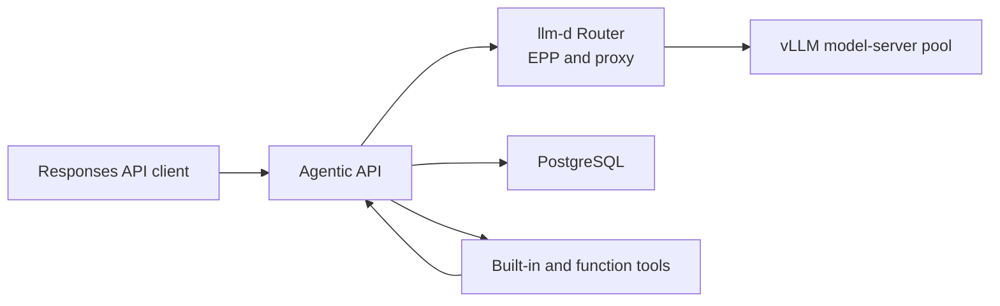

# Deploy agentic-api on Kubernetes

The repository includes a Kustomize-compatible base in `deploy/kubernetes`. It runs two stateless gateway replicas
against managed PostgreSQL and an external OpenAI-compatible inference service. The Service is `ClusterIP` because the
portable base does not choose an identity provider or expose an Ingress. Enable the gateway's native OIDC validation
or put an authenticated application boundary in front of it before allowing traffic from outside the cluster.

## Local Files API storage

The base deployment uses PostgreSQL for API metadata and a read-only container
filesystem. To use the Files API, add a persistent writable volume and set
`AGENTIC_FILES_STORAGE_DIR` to its mount path. The default two replicas must share
that volume; otherwise, use a single replica with persistent local storage.
Back up uploaded bytes together with the database. See the
[Files and vector stores API guide](../api/file-search.md).

## Prepare the image and configuration

Build and publish the production image described in the [container guide](container.md). The base uses
`agentic-api:dev` so it also works with images loaded directly into a local cluster. Before deploying to a shared
cluster, replace that image with an immutable registry digest in an environment-specific Kustomize overlay such as
`deploy/overlays/production/kustomization.yaml`. Keep overlays outside `deploy/kubernetes`: Kustomize rejects a base
that is an ancestor of the overlay directory with a "cycle detected" error.

```yaml
apiVersion: kustomize.config.k8s.io/v1beta1
kind: Kustomization
namespace: agentic-api
resources:
  - ../../kubernetes
images:
  - name: agentic-api
    newName: registry.example.com/vllm/agentic-api
    digest: sha256:replace-with-the-published-digest
```

Change `LLM_API_BASE` and `CORS_ALLOWED_ORIGINS` in `deploy/kubernetes/configmap.yaml` or patch them in the same
overlay. `deploy/overlays/kind` is the working example for Docker Desktop on macOS and Windows: it points
`LLM_API_BASE` at `host.docker.internal:5050` on the host. On native Linux Docker, apply
`deploy/overlays/kind-linux` instead; it layers the `hostAliases` entry that `host.docker.internal` needs there on
top of the same overlay. When the host inference service listens on a different port, override `LLM_API_BASE`
without editing the checked-in overlay. Use the overlay that matches your host:

macOS or Windows with Docker Desktop:

```console
kubectl kustomize deploy/overlays/kind |
  sed 's#host.docker.internal:5050#host.docker.internal:8000#' |
  kubectl apply --filename=-
```

Native Linux Docker:

```console
kubectl kustomize deploy/overlays/kind-linux |
  sed 's#host.docker.internal:5050#host.docker.internal:8000#' |
  kubectl apply --filename=-
```

Keep `SKIP_LLM_READY_CHECK=false` when the inference service exposes `/health`. The recurring upstream check
uses `OPENAI_API_KEY` as a bearer credential when configured. For a provider without `/health`, set
`SKIP_LLM_READY_CHECK=true`; `/ready` will continue checking PostgreSQL but will omit the upstream check. Add a small
Responses API request as an external monitor in that configuration.

Create the namespace and Secret before applying the workload. Prefer an external secret manager in production. For a
manual deployment, write the values to a mode-`0600` file outside the repository so credentials do not enter shell
history or process arguments:

```console
kubectl apply -f deploy/kubernetes/namespace.yaml
install -m 600 /dev/null /tmp/agentic-api-secret.env
$EDITOR /tmp/agentic-api-secret.env
kubectl --namespace agentic-api create secret generic agentic-api \
  --from-env-file=/tmp/agentic-api-secret.env \
  --dry-run=client --output=yaml |
  kubectl apply --server-side --field-manager=agentic-api-operator --filename=-
```

The protected file contains `DATABASE_URL=postgresql://...?...` and, when needed, `OPENAI_API_KEY=...`. Remove it
securely after the Secret has been created.

Omit `OPENAI_API_KEY` when the inference service does not require a fallback credential. The request's
`Authorization` or Anthropic-compatible `x-api-key` header still takes precedence where the protocol requires it.
`secret.example.yaml` documents the expected keys but is deliberately excluded from the Kustomize base. Do not add
real credentials to that file or commit a generated Secret. Kubernetes Secrets are only base64-encoded by default;
enable encryption at rest and restrict Secret access in the cluster.

The PostgreSQL example requires TLS certificate and hostname verification. When the database uses a private CA, append
`&sslrootcert=/path/to/postgres-ca.pem` to the example `DATABASE_URL` and mount that read-only CA file through a
production overlay.

## Use llm-d as the inference backend

[llm-d](https://llm-d.ai/) can sit between Agentic API and an in-cluster model-serving pool. Agentic API continues to
own Responses API state, tool orchestration, and the tool loop. The llm-d Router owns model-server selection and can
place requests by load and estimated prefix-cache reuse.



This section assumes that the llm-d Router and model servers are already installed. Follow the upstream
[llm-d quickstart](https://github.com/llm-d/llm-d/blob/main/docs/getting-started/quickstart.md) for a small standalone
deployment or the
[optimized baseline](https://github.com/llm-d/llm-d/tree/main/guides/optimized-baseline) for prefix-cache-aware and
load-aware routing. Keep the llm-d installation in its own namespace so its model-server resources and lifecycle are
independent from the Agentic API gateway.

### Verify llm-d before connecting Agentic API

Resolve the Router Service created by the llm-d installation. The upstream quickstart names the standalone Service
`<release>-epp`; use the actual Service name and port from your release:

```console
kubectl --namespace llm-d-optimized-baseline get services
kubectl --namespace llm-d-optimized-baseline get pods
```

Run the check from inside the cluster. This catches Service DNS, NetworkPolicy, proxy, EPP, and model-server failures
before Agentic API is involved:

```console
kubectl --namespace llm-d-optimized-baseline run llm-d-check \
  --rm --stdin --restart=Never \
  --image=curlimages/curl:8.10.1 \
  --command -- \
  curl --fail --show-error \
  http://optimized-baseline-epp.llm-d-optimized-baseline.svc.cluster.local/v1/models
```

Replace `optimized-baseline-epp` when the Helm release uses another name. Use a digest-pinned diagnostic image when
cluster policy requires immutable images.

Agentic API also probes `<LLM_API_BASE>/health` during startup and readiness. Verify that path through the Router:

```console
kubectl --namespace llm-d-optimized-baseline run llm-d-health-check \
  --rm --stdin --restart=Never \
  --image=curlimages/curl:8.10.1 \
  --command -- \
  curl --fail --show-error \
  http://optimized-baseline-epp.llm-d-optimized-baseline.svc.cluster.local/health
```

If the selected llm-d proxy does not expose `/health`, set `SKIP_LLM_READY_CHECK=true` in the Agentic API overlay and
monitor a small inference request externally. Do not disable the check merely to hide an unreachable or unhealthy
Router.

### Point Agentic API at llm-d

Patch the production overlay so `LLM_API_BASE` uses the Router's cluster-local Service DNS name. For the upstream
optimized-baseline naming convention:

```yaml
apiVersion: kustomize.config.k8s.io/v1beta1
kind: Kustomization
namespace: agentic-api
resources:
  - ../../kubernetes
patches:
  - target:
      kind: ConfigMap
      name: agentic-api
    patch: |-
      - op: replace
        path: /data/LLM_API_BASE
        value: http://optimized-baseline-epp.llm-d-optimized-baseline.svc.cluster.local
```

The request's `model` must match a name advertised by the llm-d model-server pool. Agentic API passes that model name
through to the OpenAI-compatible inference endpoint. When the Router serves several models, verify each name through
`/v1/models` before exposing it to clients.

Render the overlay and confirm that it contains the expected URL only once:

```console
kubectl kustomize deploy/overlays/production |
  grep -n -A1 'LLM_API_BASE'
```

Apply the overlay and wait for the gateway. ConfigMap data is injected into the process environment, so an existing
pod must be replaced before it can use a new Router URL:

```console
kubectl apply -k deploy/overlays/production
kubectl --namespace agentic-api rollout restart deployment/agentic-api
kubectl --namespace agentic-api rollout status deployment/agentic-api
kubectl --namespace agentic-api logs deployment/agentic-api --tail=20
```

Confirm that the logs contain `gateway listening on 0.0.0.0:9000` and `gateway dependencies ready`. If the Deployment
declares the same variable under both `env` and `envFrom`, the explicit `env` entry wins. Keep `LLM_API_BASE`,
`RUST_LOG`, and similar non-secret settings in one source so an old pod-template override cannot silently supersede
the ConfigMap.

### Size the model servers separately

Agentic API CPU and memory settings do not size the llm-d model servers. Choose vLLM resources from the model,
precision, context length, concurrency target, and accelerator, then calibrate llm-d's saturation-aware routing for
that model and hardware combination as described by the upstream optimized-baseline guide.

For one concrete sizing data point, a direct-vLLM deployment validated on CoreWeave served `Qwen/Qwen3-8B` with vLLM
v0.26.0 and a 32,768-token context window on one H100 80 GB. The vLLM pod requested 4 CPU, 24 GiB of memory, and one
GPU, with limits of 8 CPU and 48 GiB. Treat this as a smoke-test profile, not an llm-d performance recommendation:
prefix-cache-aware routing only provides value when a pool has multiple model-server replicas, and a different model
or workload needs new measurements.

## Deploy and inspect the gateway

Render and schema-check the base before applying it. CI runs the same validation with pinned kubectl and kubeconform
releases against the Kubernetes 1.36 schema:

```console
kubectl kustomize deploy/kubernetes |
  kubeconform -kubernetes-version 1.36.0 -strict -summary
```

This catches Kustomize build failures, unknown Kubernetes fields, duplicate keys, and schema type errors. It does not
replace admission-policy or server-side validation in the target cluster, so validate environment overlays against a
representative cluster before production rollout.

Apply the base or the environment overlay:

```console
kubectl apply -k deploy/kubernetes
kubectl --namespace agentic-api rollout status deployment/agentic-api
kubectl --namespace agentic-api get pods,service,networkpolicy,poddisruptionbudget
```

ConfigMap and Secret values are injected as environment variables and do not update inside existing pods. After
changing either object without otherwise changing the pod template, run
`kubectl --namespace agentic-api rollout restart deployment/agentic-api` and wait for the rollout to finish.

Use immutable image digests in shared clusters. A rollout restart changes the pod template, but
`imagePullPolicy: IfNotPresent` with a reused mutable tag can still start a cached image on the selected node. If a
development workflow must reuse a tag, set `imagePullPolicy: Always` in that environment's overlay and verify the
running pod's `imageID`; production overlays should continue using a digest.

The base defines:

- two gateway replicas with a rolling update that keeps the current replicas available;
- a `ClusterIP` Service on port `9000`;
- startup and liveness probes on `/health`, plus a readiness probe on `/ready`;
- a 30-second pod termination grace period for endpoint propagation and the gateway's bounded eight-second drain;
- CPU and memory requests and limits that should be tuned from observed traffic;
- a preferred hostname anti-affinity rule for the two gateway replicas;
- a non-root, read-only root filesystem with no Linux capabilities or mounted service-account token, plus a small
  `emptyDir` mounted at `/var/lib/agentic-api` for the generated `config.toml` (the gateway also starts without a
  writable home and keeps that configuration in memory);
- a default-deny ingress NetworkPolicy; and
- a PodDisruptionBudget that retains one replica during voluntary disruption.

The startup probe allows up to eleven minutes. The Deployment bounds the upstream startup wait at five minutes,
leaving about six minutes for the database connection and embedded migrations before Kubernetes restarts the pod. The
sixteen-minute rollout progress deadline leaves another five minutes for scheduling and a cold image pull. The process
does not bind its port until both startup steps succeed. `/health` then reports process liveness without depending on
remote services. `/ready` runs bounded PostgreSQL and inference checks concurrently and removes a pod from Service
endpoints when either required dependency fails.

The base's CPU and memory requests are lower than its limits, so pods use Kubernetes' `Burstable` quality-of-service
class and can be evicted before `Guaranteed` pods under node pressure. Tune both values from measurements; set requests
equal to limits in a production overlay when eviction priority is more important than burst capacity.

## Choose a migration policy

By default, every new pod applies the embedded SQLx migrations before starting the HTTP server. PostgreSQL migration
locking serializes concurrent migration attempts, and a failed migration keeps the pod out of service. Keep migrations
backward-compatible with the previous gateway version so a rolling update can run old and new replicas together.

The first upgrade from a release that used 32-bit timestamp and sequence columns is an exception: do not use the base
rolling strategy for that upgrade. Older replicas do not take the per-conversation row lock and can allocate duplicate
sequence values while an upgraded replica is serving. During a maintenance window:

1. stop or drain inbound writers, scale every older gateway replica to zero, and verify that no old pod remains;
2. run the duplicate `(conversation_id, seq)` query in the
   [PostgreSQL upgrade notes](container.md#postgresql-production-settings), resolving any rows according to the
   deployment's data-retention policy;
3. apply the compatibility migration with a dedicated migration role, or start exactly one upgraded replica and wait
   for its embedded migration to finish;
4. verify that the integer columns and unique conversation-sequence index are present; and
5. start the upgraded Deployment, restore the desired replica count, and reopen inbound traffic only after `/ready`
   succeeds.

Ordinary rolling updates are appropriate only after every migration in the target release has been verified as
expand/contract compatible with the previously deployed gateway.

For a supervisor-managed schema:

1. apply the repository migrations in a release job before updating the Deployment;
2. verify the target schema and any required compatibility upgrades;
3. set `AGENTIC_API_SCHEMA_READY=1` in the gateway ConfigMap; and
4. roll out the gateway only after the release job succeeds.

The runtime image intentionally contains no shell database client, and the gateway has no migration-only command, so
the base does not pretend to provide an in-image migration Job. Use a trusted database migration image or deployment
controller. Never set `AGENTIC_API_SCHEMA_READY` merely to bypass a failed migration.

## Authenticate inbound callers

Do not use `OPENAI_API_KEY` as a caller password. It is an upstream inference credential. Exposing the gateway directly
would let anonymous callers spend that credential and read or write unscoped stored state.

The gateway can validate inbound OIDC bearer tokens itself. Add `OIDC_ISSUER` and `OIDC_AUDIENCE` to an
environment-specific ConfigMap patch; both values are required together. The issuer must use HTTPS outside loopback
development. Every `/v1/*` HTTP and WebSocket route then requires a valid bearer token, while `/health` and `/ready`
remain available to Kubernetes probes. Follow the [OIDC validation contract](../design/oidc-bearer-authentication.md)
and the [GitHub and Dex tutorial](github-oidc.md) when configuring the provider and clients.

Route only the authenticated `/v1/*` paths through a public Ingress; Kubernetes can probe `/health` and `/ready`
directly through the pod network. If platform constraints expose either probe path, restrict or rate-limit it
separately.

Alternatively, put an identity-aware proxy or authenticated application service in front of the gateway. In that
mode, leave the gateway's OIDC variables unset and ensure the trusted edge protects every `/v1/*` HTTP and WebSocket
route. For ingress-nginx, configure external authentication and include settings equivalent to:

```yaml
metadata:
  annotations:
    nginx.ingress.kubernetes.io/auth-url: "https://auth.example.com/verify"
    nginx.ingress.kubernetes.io/proxy-buffering: "off"
    nginx.ingress.kubernetes.io/proxy-http-version: "1.1"
    nginx.ingress.kubernetes.io/proxy-read-timeout: "3600"
    nginx.ingress.kubernetes.io/proxy-send-timeout: "3600"
```

Use TLS and appropriate connection and request limits. With external authentication, the boundary must consume and
strip caller `Authorization` and `x-api-key` headers before forwarding to a gateway whose native OIDC validation is
disabled; otherwise those values are treated as upstream inference credentials instead of using the configured
fallback. Use mTLS or another platform control between the edge and gateway so only the trusted boundary can reach
the Service.

The base NetworkPolicy denies all pod-network ingress to the gateway. When the authenticated boundary is an
ingress-nginx controller, copy `network-policy-ingress.example.yaml` into the overlay with the authenticated Ingress.
Its selectors
admit only pods labeled `app.kubernetes.io/name=ingress-nginx` in the `ingress-nginx` namespace. Patch both selectors
when the controller uses different labels or a different namespace. Keep the default-deny policy in place, and verify
that the cluster's network plugin enforces NetworkPolicy before relying on it as a security boundary.

Those selectors trust the whole matching ingress controller, not one Ingress object. In a shared or multi-tenant
controller, use admission policy and RBAC to prevent untrusted routes from selecting this Service, or deploy a dedicated
controller. Prefer mTLS or workload identity between the boundary and gateway when controller tenancy is not exclusive.

The portable base does not restrict egress because the DNS resolver, managed PostgreSQL addresses, ports, and external
inference destinations are environment-specific. Add a default-deny egress policy and explicit DNS, database, and
inference allowances in the production overlay when the cluster's network plugin can express those destinations.

SSE streams need buffering disabled from the client through every proxy. WebSocket clients should use `wss`, send
keepalive pings, and reconnect with backoff after a rollout or node disruption. Stored continuation state is in
PostgreSQL, so reconnects do not require session affinity; clients can continue with a conversation or previous
response ID through any ready replica.

Kubernetes begins endpoint removal at the same time as graceful pod termination. The five-second `preStop` delay gives
controllers time to observe the terminating endpoint before `SIGTERM` reaches the gateway. The gateway then stops
accepting new requests, drains active HTTP requests and WebSockets for up to eight seconds, and exits. The 30-second
grace period includes both phases. Verify the external load balancer's endpoint propagation and retry behavior.

Preferred anti-affinity encourages the scheduler to place replicas on different nodes without making a single-node
development cluster unschedulable. Use hard topology-spread constraints across nodes or zones when production
availability requires them. The PodDisruptionBudget only limits voluntary disruptions; it cannot prevent simultaneous
loss of co-located replicas during a node failure.

## Verify persistence and transport

Reach the private Service through a temporary port-forward in a separate terminal:

```console
kubectl --namespace agentic-api port-forward service/agentic-api 9000:9000
curl --fail http://127.0.0.1:9000/health
curl --fail http://127.0.0.1:9000/ready
```

The `/v1/*` examples below include an OIDC bearer header. When native OIDC validation is enabled, set `OIDC_TOKEN` to
a valid ID token. When an external boundary supplies authentication instead, remove that header. Health and readiness
requests do not require it.

Send a stored Responses request, save its response ID, restart the Deployment, and continue with
`previous_response_id`. A successful continuation after the rollout verifies that PostgreSQL, rather than a pod
filesystem, owns the state:

```console
first_response_id=$(
  curl --fail --silent --show-error http://127.0.0.1:9000/v1/responses \
    --header "Authorization: Bearer $OIDC_TOKEN" \
    --header "Content-Type: application/json" \
    --data '{"model":"Qwen/Qwen3-30B-A3B-FP8","input":"Reply with READY","store":true}' |
    jq --exit-status --raw-output .id
)

kubectl --namespace agentic-api rollout restart deployment/agentic-api
kubectl --namespace agentic-api rollout status deployment/agentic-api
```

The port-forward exits when the selected pod terminates. Start the same `kubectl port-forward` command again after the
rollout, then continue the request:

```console
curl --fail --silent --show-error http://127.0.0.1:9000/v1/responses \
  --header "Authorization: Bearer $OIDC_TOKEN" \
  --header "Content-Type: application/json" \
  --data "$(jq --null-input --arg id "$first_response_id" '{
    model: "Qwen/Qwen3-30B-A3B-FP8",
    input: "What word did you return?",
    previous_response_id: $id,
    store: true
  }')"
```

Repeat the check through the authenticated ingress for HTTP streaming and WebSockets before a production release.
Size PostgreSQL pools, gateway replicas, and inference capacity together; adding gateway replicas cannot compensate
for a saturated database or inference service.

## Enable and verify web search

The `web_search_preview` built-in tool is executed by Agentic API when `YOU_API_KEY` and `YOU_API_BASE_URL` are
configured. Keep the key in a Secret and use the current You.com Search API base URL, `https://ydc-index.io`.

Create the Secret from a protected environment file so the key does not enter shell history or process arguments:

```console
install -m 600 /dev/null /tmp/agentic-api-web-search.env
$EDITOR /tmp/agentic-api-web-search.env
kubectl --namespace agentic-api create secret generic agentic-api-web-search \
  --from-env-file=/tmp/agentic-api-web-search.env \
  --dry-run=client --output=yaml |
  kubectl apply --server-side --field-manager=agentic-api-operator --filename=-
```

The file contains one line, `YOU_API_KEY=...`. Remove it securely after creating the Secret. Patch the environment in
the production overlay:

```yaml
patches:
  - target:
      kind: ConfigMap
      name: agentic-api
    patch: |-
      - op: add
        path: /data/YOU_API_BASE_URL
        value: https://ydc-index.io
      - op: add
        path: /data/MESSAGES_GATEWAY_TOOL_ALIASES
        value: WebSearch=web_search
  - target:
      kind: Deployment
      name: agentic-api
    patch: |-
      - op: add
        path: /spec/template/spec/containers/0/envFrom/-
        value:
          secretRef:
            name: agentic-api-web-search
```

`MESSAGES_GATEWAY_TOOL_ALIASES` is required only when Claude Code's client-owned `WebSearch` function should be
executed by the gateway. Responses API clients declare web search structurally and do not need this alias. Leaving
the setting empty preserves the default client-owned behavior.

Apply the overlay, restart the Deployment after every Secret update, and wait for readiness:

```console
kubectl apply -k deploy/overlays/production
kubectl --namespace agentic-api rollout restart deployment/agentic-api
kubectl --namespace agentic-api rollout status deployment/agentic-api
```

With the Service port-forward running, submit a web-search request and require at least one completed
`web_search_call` output item:

```console
curl --fail --silent --show-error http://127.0.0.1:9000/v1/responses \
  --header "Authorization: Bearer $OIDC_TOKEN" \
  --header 'Content-Type: application/json' \
  --data '{
    "model": "Qwen/Qwen3-8B",
    "stream": false,
    "tools": [{"type": "web_search_preview"}],
    "input": "Search the web for the latest vLLM release."
  }' |
  jq --exit-status 'any(.output[]?; .type == "web_search_call" and .status == "completed")'
```

Remove the `Authorization` header when inbound OIDC validation is disabled. A top-level response can have
`status: "completed"` even when an individual `web_search_call` failed, so inspect the output item status rather than
only the response status. A `403 Forbidden` from You.com means the external search request was rejected; confirm the
documented base URL and refresh the Secret, restart the Deployment, and test again without printing the key.
