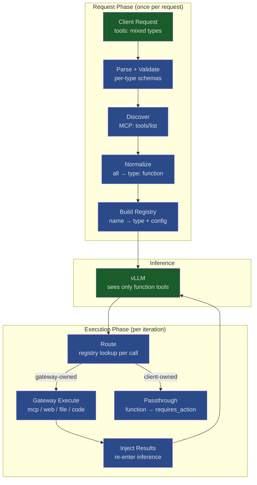

# Design: Tool Framework

> Status: Proposal
> References: [ADR-01 D7](../adr/ADR-01_core.md), [ADR-03 D3](../adr/ADR-03_gateway_integration.md)

---

## Problem

Clients send heterogeneous tool types (`function`, `mcp`, `web_search`, `file_search`, `code_interpreter`). vLLM only speaks function calling — it produces `function_call` output items regardless of tool origin. The gateway must bridge both directions: normalize inbound tools for inference, and route outbound calls to their correct executors.

Today `ResponsesTool = FunctionTool`. This design replaces that with a type-aware framework that handles the full tool lifecycle for any tool type through a single pipeline.

---

## Principles

1. **One pipeline, many types.** The tool lifecycle is the same for all types. What varies is the behavior at each stage.
2. **vLLM is function-only.** Every tool type normalizes to `type: "function"` before inference. Permanent constraint.
3. **Routing by registry, not heuristics.** After inference, `function_call` items are looked up in a request-scoped registry that maps names back to origin type and config.
4. **Function tools are client-owned.** `type: "function"` is never gateway-executed. The response returns `status: "requires_action"` and the client resolves it. All other types are gateway-executed.
5. **Additive.** New tool types implement a trait and register. The executor loop doesn't change.

---

## Architecture



---

## Pipeline Stages

Every request with tools passes through 7 stages. Stages 1–4 run once at request start. Stages 5–7 repeat per inference iteration.

| # | Stage | Generic (framework) | Type-Specific (handler) |
|---|-------|---------------------|-------------------------|
| 1 | **Parse** | Deserialize `tools[]`, classify by `type` | Validate required fields per type |
| 2 | **Discover** | Iterate handlers, collect discovered tools | MCP: `tools/list`. Others: no-op |
| 3 | **Normalize** | Flatten all into `Vec<FunctionTool>` for vLLM | MCP: schema → parameters. WebSearch: synthetic def |
| 4 | **Register** | Build `HashMap<name, ToolEntry>` | Each handler declares ownership of its tool names |
| 5 | **Route** | Lookup `function_call.name` in registry | Determine: gateway-execute or client-passthrough |
| 6 | **Execute** | Parallel execution with timeout + error isolation | MCP: JSON-RPC. WebSearch: HTTP API. Function: skip |
| 7 | **Emit** | Forward type-specific SSE events to client | MCP: 7 events. WebSearch: 2 events. Function: 0 |

Stages 1–4 produce two artifacts:
- **Normalized tools** — `Vec<FunctionTool>` forwarded to vLLM
- **Tool registry** — `ToolRegistry` consumed by dispatch for routing

---

## Core Types

### Tool Classification

```rust
#[derive(Debug, Clone, Copy, PartialEq, Eq, Hash)]
pub enum ToolType {
    Function,
    Mcp,
    WebSearch,
    FileSearch,
    CodeInterpreter,
}
```

### Request-Side Tool Param

Replaces `pub type ResponsesTool = FunctionTool`:

```rust
#[derive(Debug, Clone, Serialize, Deserialize)]
#[serde(tag = "type")]
pub enum ResponsesTool {
    #[serde(rename = "function")]
    Function(FunctionToolParam),

    #[serde(rename = "mcp")]
    Mcp(McpToolParam),

    #[serde(rename = "web_search_preview")]
    WebSearch(WebSearchToolParam),

    #[serde(rename = "file_search")]
    FileSearch(FileSearchToolParam),

    #[serde(rename = "code_interpreter")]
    CodeInterpreter(CodeInterpreterToolParam),
}
```

`#[serde(tag = "type")]` makes this wire-compatible with existing `{"type":"function",...}` requests.

### Tool Registry

```rust
pub struct ToolEntry {
    pub tool_type: ToolType,
    pub config: Value,
    pub server_label: Option<String>,
}

pub struct ToolRegistry {
    entries: HashMap<String, ToolEntry>,
}

impl ToolRegistry {
    pub fn lookup(&self, tool_name: &str) -> Option<&ToolEntry>;
    pub fn gateway_owned_calls<'a>(&self, calls: &'a [FunctionToolCall]) -> Vec<&'a FunctionToolCall>;
    pub fn client_owned_calls<'a>(&self, calls: &'a [FunctionToolCall]) -> Vec<&'a FunctionToolCall>;
}
```

### Loop Decision

```rust
#[derive(Debug)]
#[non_exhaustive]
pub enum LoopDecision {
    /// Gateway tools executed — inject results and re-infer.
    Continue(Vec<InputItem>),

    /// No tool calls — return response as completed.
    Done,

    /// Only client-owned function calls — return requires_action.
    RequiresAction(Vec<FunctionToolCall>),

    /// Mixed: gateway tools executed AND client calls pending.
    /// Loop back; on next pass if only client calls remain → RequiresAction.
    ContinuePartial {
        results: Vec<InputItem>,
        pending_client_calls: Vec<FunctionToolCall>,
    },

    /// Safety cap reached.
    Incomplete(String),
}
```

---

## The ToolHandler Trait

Each tool type implements this:

```rust
#[async_trait]
pub trait ToolHandler: Send + Sync {
    fn tool_type(&self) -> ToolType;

    fn validate(&self, param: &Value) -> Result<(), ToolError>;

    async fn discover(&self, param: &Value) -> Result<Vec<DiscoveredTool>, ToolError> {
        Ok(vec![]) // default: no discovery needed
    }

    fn normalize(&self, param: &Value, discovered: &[DiscoveredTool]) -> Vec<FunctionTool>;

    async fn execute(
        &self,
        tool_name: &str,
        arguments: &str,
        config: &Value,
    ) -> Result<ToolOutput, ToolError>;

    fn event_prefix(&self) -> Option<&'static str> {
        None // default: no special SSE events
    }

    fn output_item_type(&self) -> &'static str;
}
```

Adding a new tool type = implementing this trait + registering it. No changes to the executor loop, accumulator, or streaming path.

---

## Per-Type Behavior

| Stage | `function` | `mcp` | `web_search` | `file_search` | `code_interpreter` |
|-------|-----------|-------|-------------|--------------|-------------------|
| Validate | name required | server_url required | (none) | vector_store_ids required | (none) |
| Discover | no-op | `tools/list` on server | no-op | no-op | no-op |
| Normalize | passthrough | McpToolDef → FunctionTool | synthetic `web_search(query)` | synthetic `file_search(query)` | synthetic `code_interpreter(code)` |
| Route | → client | → gateway | → gateway | → gateway | → gateway |
| Execute | N/A | JSON-RPC `tools/call` | HTTP search API | vector store query | sandboxed container |
| SSE events | `function_call_arguments.*` | `mcp_call.*` (7 events) | `web_search_call.*` (2) | `file_search_call.*` (2) | `code_interpreter_call.*` |
| Response status | `requires_action` | `completed` | `completed` | `completed` | `completed` |

---

## Mixed-Tool Request Walkthrough

Request:
```json
{
  "tools": [
    {"type": "function", "name": "run_shell", "parameters": {...}},
    {"type": "mcp", "server_label": "db", "server_url": "http://db-mcp:8080"},
    {"type": "web_search_preview"}
  ],
  "input": "Find papers on RLHF, check our DB, then run the import script"
}
```

**Preparation:**
- Discover: MCP server returns `[query_papers, insert_paper]`
- Registry: `run_shell → Function`, `query_papers → Mcp`, `insert_paper → Mcp`, `web_search → WebSearch`
- vLLM sees 4 function tools

**Iteration 1:** Model calls `web_search("RLHF papers")` → gateway executes → loop back

**Iteration 2:** Model calls `query_papers("topic=RLHF")` → gateway executes via JSON-RPC → loop back

**Iteration 3:** Model calls `run_shell("python import.py")` → registry lookup → `Function` → **client-owned** → response returns `status: "requires_action"`

Client executes locally, submits `function_call_output`, inference continues.

---

## Shipping Plan

| PR | Scope | Depends on |
|----|-------|------------|
| **A: Tool Types + Registry** | `ToolType` enum, `ResponsesTool` enum, `ToolRegistry`, `ToolHandler` trait, `FunctionHandler`, normalize pipeline. No execution logic. | io types refactor |
| **B: Type-Aware Dispatch** | Registry-based routing in `dispatch_tools`, `LoopDecision::RequiresAction` + `ContinuePartial`, `HandlerRegistry`. | PR A |
| **C: MCP Handler** | First real `ToolHandler` impl — `tools/list` + `tools/call` via JSON-RPC. Stateless HTTP client. | PR A |
| **D: Tool SSE Events** | Type-specific event emission during execution. Extends `SSEEventType`. | PR B + streaming |
| **E: Output Item Types** | `OutputItem::McpCall`, `OutputItem::WebSearchCall`, etc. Storage + serialization. | PR B |

PR A lands independently. PR C can parallelize with PR B. Future handlers (web_search, file_search, code_interpreter) implement the same trait.

---

## Design Decisions

| # | Decision | Rationale |
|---|----------|-----------|
| D1 | Registry-based routing | Name prefixes leak implementation into the model's tool namespace. Registry is invisible to inference. |
| D2 | Request-scoped registry | Different requests may target different MCP servers. Global state would require sync and conflict resolution. |
| D3 | `function` never gateway-executed | Matches OpenAI spec. Enables agent clients (Codex, etc.) that own their tool implementations. "No client delegation" means the gateway doesn't punt *its* work — not that function tools can't exist. |
| D4 | `ContinuePartial` in LoopDecision | Mixed requests need to execute gateway tools and loop, while tracking that client tools also exist. Without this, we'd skip gateway tools or lose client tools. |
| D5 | MCP client is stateless | Each request opens fresh connections. Connection pooling per `server_url` is a follow-up optimization. |
| D6 | `ResponsesTool` uses `#[serde(tag = "type")]` | Wire-compatible with existing `{"type":"function",...}` — no client migration needed. |

---

## Open Questions

| # | Question | Proposed Answer |
|---|----------|-----------------|
| Q1 | What if MCP `tools/list` returns a name colliding with a `function` tool? | Function wins (client-defined takes precedence). Emit warning log. |
| Q2 | How does `ContinuePartial` look to the streaming client? | Gateway tool events stream in real-time. Final status is `requires_action`. Client already handles incremental events. |
| Q3 | Should `tool_choice: {function: {name: "x"}}` work for MCP-discovered tools? | Yes. vLLM sees all normalized functions. If the forced name is MCP-originated, the call routes through MCP naturally. |
| Q4 | Should `prepare_tools` be a Praxis filter or part of `execute_loop`? | Part of `execute_loop` in core. Praxis wraps the whole loop, not individual tool stages. |
