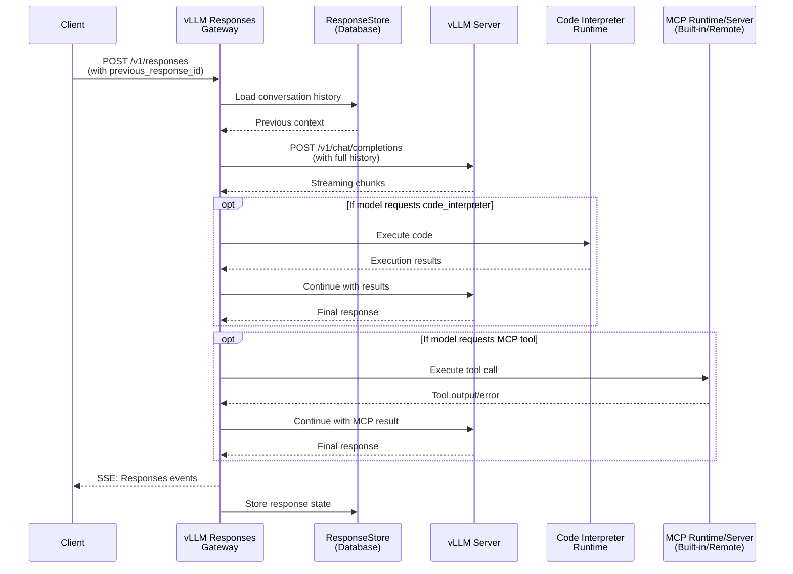

# Architecture

Understand how `vLLM Responses` bridges the gap between the OpenAI Responses API and vLLM.

## Overview

At its core, `vLLM Responses` is a translation layer (or "gateway"). It sits between your client application and your vLLM inference server, adding statefulness, built-in tool execution (including Code Interpreter and `web_search`), MCP integration (Built-in MCP and Remote MCP), and spec-compliant streaming.

### Request Flow

1. **Client** sends a request to `/v1/responses`, optionally including a `previous_response_id` to continue a conversation.
1. **Gateway** rehydrates conversation history from the **ResponseStore** (database) if a `previous_response_id` is provided.
1. **Gateway** transforms the Responses request into a Chat Completions request and sends it to **vLLM** with the full conversation history.
1. **vLLM** generates tokens and streams them back to the gateway as Chat Completions chunks.
1. **Gateway** normalizes vLLM output into a stable internal event stream and composes spec-compliant Responses SSE events.
1. If the model requests a **gateway-executed tool** (for example Code Interpreter, `web_search`, or an MCP tool):
    - The gateway executes the tool call (locally for built-ins, or via Built-in MCP / Remote MCP transport).
    - Results are fed back to vLLM to continue generation.
    - All of this happens within a single API request.
1. **Gateway** streams Responses events back to the client in real-time.
1. **Gateway** persists terminal storable response state (`completed` and `incomplete`, when `store=true`) to the database for future `previous_response_id` lookups.

______________________________________________________________________

## Key Concepts

### The Responses API

The [OpenAI Responses API](https://www.openresponses.org/specification) is a newer, richer protocol than Chat Completions. It treats a "Response" as a first-class object that can contain multiple output items (messages, tool calls, thinking blocks). This gateway implements the OpenResponses specification, ensuring compatibility with OpenAI's Responses API and other compliant providers.

### Statefulness

Unlike standard Chat Completions where you must send the entire conversation history with every request, the Responses API allows for **stateful conversations**.

- You send an initial request.
- The gateway returns a `response.id`.
- For the next turn, you simply pass `previous_response_id="..."` along with your new input.
- The gateway rehydrates the full context from its **ResponseStore**.

This significantly reduces bandwidth and complexity for client applications.

### Built-in Tools

The gateway includes runtimes for **built-in tools**. Current examples are the **Code Interpreter** and **`web_search`**. When the model decides to use one of these tools, the gateway executes it and returns the results within the same API request lifecycle.

For `web_search`, the gateway resolves a startup-selected profile, executes search and page-opening actions behind the public `{"type": "web_search"}` tool shape, and keeps `find_in_page` page text in a request-local cache.

### MCP Integration

The gateway can execute MCP tools declared in the request. Built-in MCP uses configured `server_label` inventory via a singleton internal runtime process shared by gateway workers; Remote MCP uses request `server_url`. Both stay in the same Responses lifecycle with consistent `mcp_call` events and output items.
